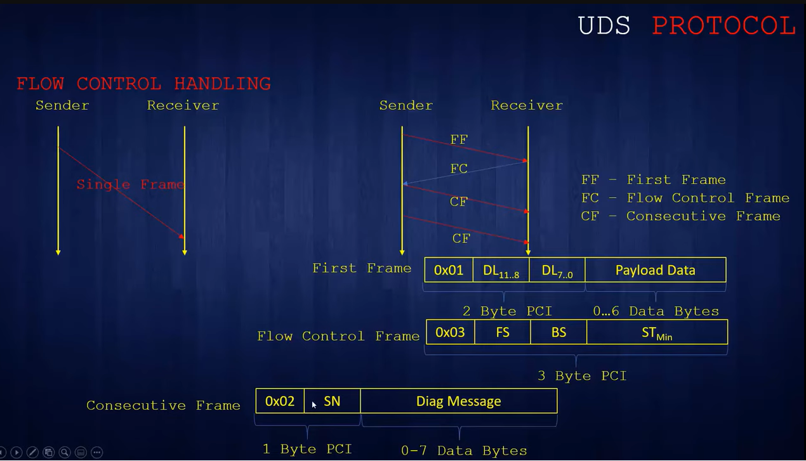

# CAPl

It allows for programming of network node models and special evaluation models.

* simulation setup - network nodes
* CAPL browser

Timer functions -  same as interrupt

Coding in .CAN file with attributes like

* on start
* on msg
* on signal
* on key

Panel Designer

UDS - Data Identifier - Read data by identifier

Flow control handling

* Not required if frame is less than 7 Bytes else required
* Required for synchronization with the server to receive complete data
* Receiver sends the FC frame to sender in order to receive frame after first frame and it contains ST min,  block size etc.

<figure><figcaption>
Flow control
</figcaption></figure>

Test modules&#x20;

Test setup ->Test Environment on the desktop ->  Insert CAPL Test Module, Insert Network Node, Insert XML Test Module

Options related to test modules

Environmental variables, system variables trigger to start CAPL module

[https://www.youtube.com/watch?v=Jv0TGmnJRJg\&list=PLYiraB-Sgw6tbIfjQtrfIx3g70j\_wdTV1\&index=8](https://www.youtube.com/watch?v=Jv0TGmnJRJg\&list=PLYiraB-Sgw6tbIfjQtrfIx3g70j\_wdTV1\&index=8)

Test Module in top bar to run the simulation.&#x20;

Link [https://www.youtube.com/watch?v=blRnw\_WU-m8](https://www.youtube.com/watch?v=blRnw\_WU-m8)

&#x20;

&#x20;&#x20;

