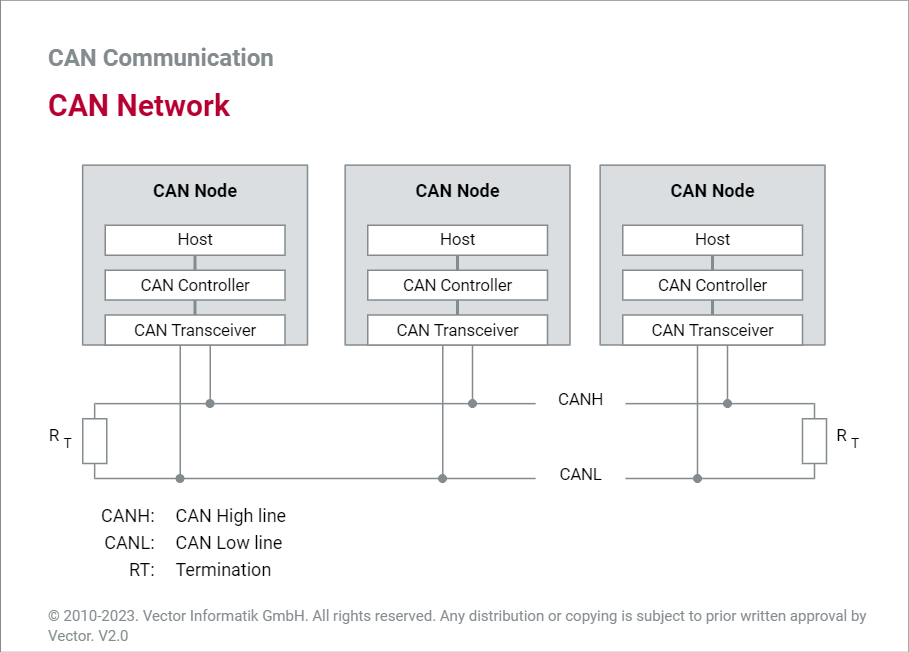

# CAN

A CAN network consists of a number of CAN nodes which are linked via a physical transmission medium. In practice, the CAN network is usually based on a line topology with a linear bus to which a number of electronic control units are each connected via a CAN interface.

<figure><figcaption>
CAN network
</figcaption></figure>

 

<figure><figcaption>
CAN lines
</figcaption></figure>

CAN bus consists of two wires, CAN low and CAN high and each ECU has the ability to receive and transmit the data to the BUS. A CAN network can have multiple masters

The maximum data rate is 1 Mbit/s. A maximum network extension of about 40 meters is allowed.&#x20;

<figure><figcaption>
Working Of CAN
</figcaption></figure>

An ECU can prepare and broadcast information (e.g. sensor data) via the CAN bus (consisting of two wires, CAN low and CAN high). The broadcasted data is accepted by all other ECUs on the CAN network - and each ECU can then check the data and decide whether to receive or ignore it.

<figure><figcaption></figcaption></figure>

 

<figure><figcaption></figcaption></figure>

Each ECU requires a CAN interface which consists of CAN controller and CAN transceiver. The [CAN transceiver](https://elearning.vector.com/mod/page/view.php?id=339) connects the CAN controller to the physical transmission medium. Twisting of the two lines reduces the magnetic field considerably. Therefore, in practice [twisted pair](https://elearning.vector.com/mod/page/view.php?id=355) conductors are generally used as the physical transmission medium

<figure><figcaption></figcaption></figure>

A [data frame](https://elearning.vector.com/mod/page/view.php?id=345) can transport a maximum payload of eight bytes. For that there is the so-called data field, which is framed by many other fields that are required to execute the CAN communication protocol. They include the message address (identifier or ID), data length code (DLC), checksum (cyclic redundancy check sequence — CRC sequence) and RX acknowledgement located in the acknowledgement field.

<figure><figcaption>
DATA Frame
</figcaption></figure>

* SOF - Start of Frame bit
* ID & RTR - sets the priority and also acceptance/receiver filtering
* IDE - Identifier extension bit to differentiate between standard format and extended format
* DLC - Data Length Code - number of payload bits
* CRC & ACK - Checksum and acknowledgement
* EOF -  After this the transmission of a data frame is terminated by seven recessive bits

Besides the data frame used to transport data, there is the remote frame — a frame type used to request data, i.e. data frames, from any CAN node.

<figure><figcaption>
CAN Frame
</figcaption></figure>

 

<figure><figcaption>
Physical signal
</figcaption></figure>

High-speed and low-speed CAN are types of Controller Area Network (CAN). CAN is a serial bus system that connects sensors and controllers in a vehicle. High-speed CAN has a data rate of up to 1 Mbit/s, while low-speed CAN has a data rate of up to 125 kbit/s

Ref: [https://www.csselectronics.com/pages/can-bus-simple-intro-tutorial](https://www.csselectronics.com/pages/can-bus-simple-intro-tutorial)
