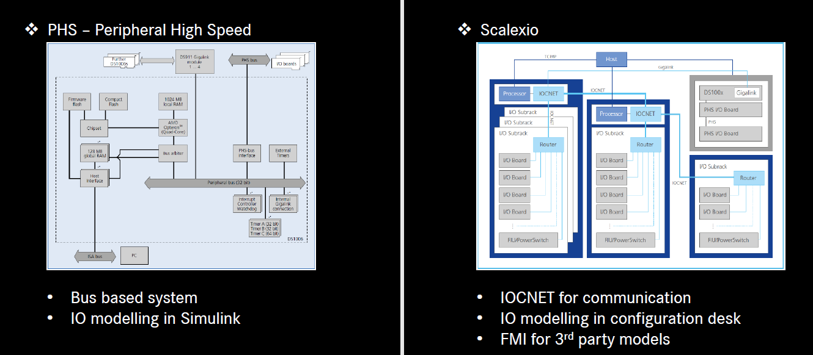

# HiL dspace

Based on different hardware setup there are 2 types of Hardware.

* PHS is used to establish a communication link between a processor board and I/O boards. PHS can support multiple I/O boards for a processor board.
* The dSPACE SCALEXIO system is a modular system that can be used for hardware-in-the-loop (HIL) and rapid control prototyping (RCP) applications.

<figure><figcaption>
PHS vs Scalexio
</figcaption></figure>

* _IOCNET_ (I/O Carrier Network) is a network technology optimized for demanding real-time requirements in terms of latencies and bandwidth
*
